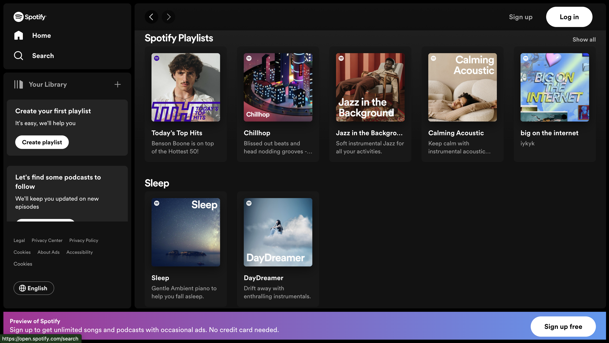
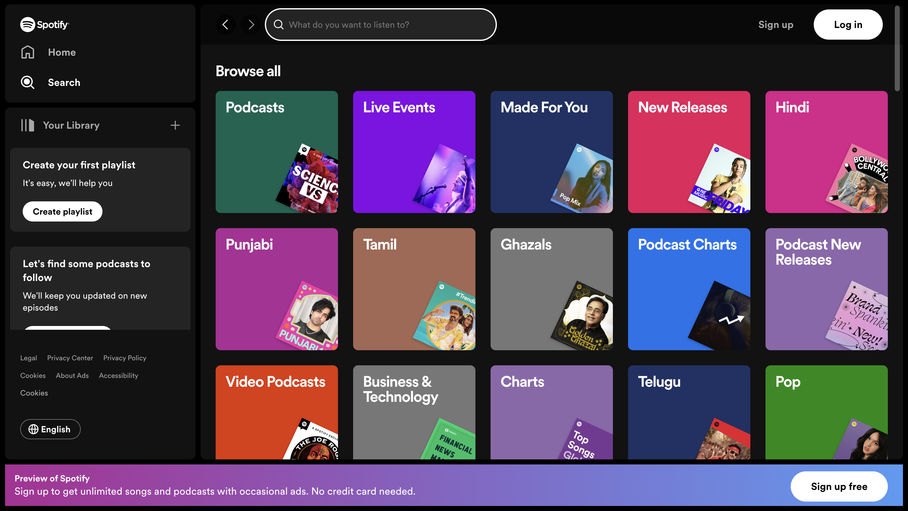
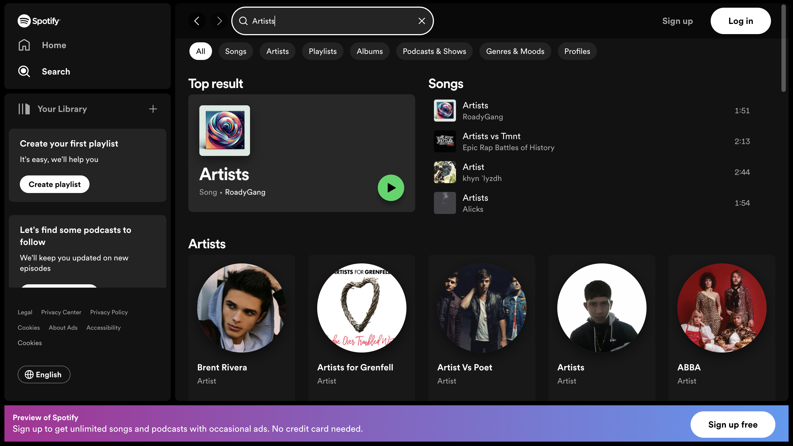

## Pull Request Details

### Changes Made:
- **Created Sidebar**:
- Added a sidebar to the application's user interface.
Typically, a sidebar provides navigation links or additional information in a vertical or horizontal layout.
Created Dashboard and Search Routes and Pages:

- **Developed specific routes and corresponding pages** for the dashboard and search functionalities.
In web development, routes define different views or pages in a single-page application.
Implemented Search Functionality:

- **Added a search feature to the application.**
Allows users to search for specific content, providing a more interactive and user-friendly experience.
Created Footer:

- **Designed and integrated a footer section into the application**.
Footers often contain additional information, links, or copyright details.

### Made It Responsive:
- Ensured that the application is responsive to different screen sizes and devices.
- Responsive design allows the application to adapt and provide an optimal user experience on various devices, such as desktops, tablets, and mobile phones.
In summary, the developer has added several key features to the application, including a sidebar for navigation, distinct routes and pages for the dashboard and search functionalities, a search function for user interaction, a footer for additional information, and ensured that the application is responsive across different devices.

****Internshala Information**:**
- Name: [Shivam Tiwari]
- Email: [shivamt2023@gmail.com]

 
- # Spotify Clone Assignment
Welcome to the Spotify Clone assignment! In this assignment, you'll be tasked with creating a Spotify clone using React, Vite for project setup, and Tailwind CSS for styling. Your application will consist of two main pages: the homepage and the search page. Additionally, you have the option to include a third page for search results.

## Instructions
Fork this Repository: Start by forking this repository to your GitHub account. This will allow you to work on your own copy of the project without affecting the original repository.

Clone the Repository: Once you've forked the repository, clone it to your local machine using the following command:

```bash
git clone https://github.com/practicehealth/spotify-clone-assignment.git
```

Set Up Environment: Make sure you have Node.js installed on your machine. Then navigate to the project directory and install the dependencies using npm or yarn:

```bash
cd spotify-clone
npm install
```
<!-- ####  Project Structure: 
Familiarize yourself with the project structure. You'll find directories for components, pages, assets, and other necessary files. -->

#### Implement the UI Components: 
Your task is to implement the UI components for the homepage, search page, and optionally the search results page. Use Tailwind CSS for styling and ensure that all UI components read data from a JSON file. Avoid hardcoding any artist names or other data directly into the components.

#### Mock Data from JSON: 
Populate the data.json file with mock data for your application. This data will be used to populate the UI components.

#### Create Pages:
Implement the logic for routing and create the necessary React components for the homepage, search page, and search results page (if you choose to include it). Ensure that the pages display the correct content and styles.
The design should be responsive on all devices including smartphones, tablets, and desktops.

#### Screenshots
Here are the screenshots of the pages you need to create:

Homepage: 

Search Page: 

(Optional) Search Results Page:

#### Testing: Test your application locally to ensure that all features work as expected. Use the Vite development server to run your application:

```bash
npm run dev
```
#### Commit Changes:
Once you're satisfied with your changes, commit them to your local repository:

```bash
git add .
git commit -m "Implemented Spotify Clone UI"
```

#### Push Changes: 
Push your commits to your forked repository on GitHub:

```bash
git push origin main
```
#### Make a Pull Request:
Finally, navigate to your forked repository on GitHub and create a pull request to submit your changes. Provide a descriptive title and details about the changes you've made. and your internshala name and email along with the PR.

Resources
[React Documentation](https://react.dev/)

[Vite Documentation](https://vitejs.dev/guide/)

[Tailwind CSS Documentation](https://tailwindcss.com/docs)

[Spotify UI For Reference](https://open.spotify.com/)

If you have any questions or need clarification on any aspect of the assignment, don't hesitate to reach out. Good luck!
